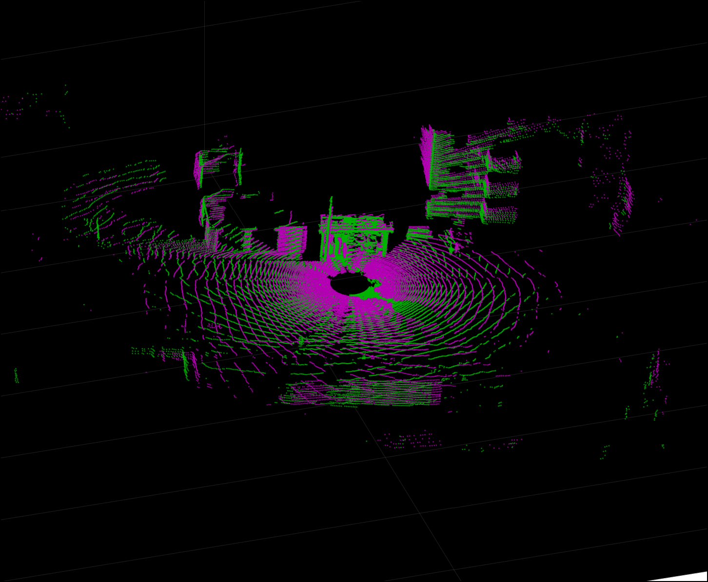

# PHASER: A Robust and Correspondence-Free Global Pointcloud Registration

*Ubuntu 18.04+ROS Melodic*: [](https://jenkins.asl.ethz.ch/job/phaser_nightly)

----------------------------

## Overview
Pointcloud registration using correspondences is inefficient and prone to errors in the many steps of correspondence extraction, description, and matching.
Similarly, the most widespread registration methods work only locally, requiring an initial guess already close to the true solution, something unaffordable in real robotic deployments.
We propose an algorithm for the registration of partially overlapping pointclouds that operates at the global level and on the raw data, i.e., no initial guess as well as no candidate matches are required.
We exploit the properties of Fourier analysis to derive a novel registration pipeline based on the cross-correlation of the phases.

### Packages
PHASER is composed of the following packages:
 - [phaser_core](https://github.com/ethz-asl/phaser/tree/master/phaser_core): The registration core of PHASER. Contains the spherical and spatial correlation.
 - [phaser_ros](https://github.com/ethz-asl/phaser/tree/master/phaser_ros): This is a ROS wrapper to use the PHASER as a registration framework. Hardly used anymore.
 - [phaser_common](https://github.com/ethz-asl/phaser/tree/master/phaser_common): Exposes common classes, utils and models.
 - [phaser_pre](https://github.com/ethz-asl/phaser/tree/master/phaser_pre): Experimental preprocessing of pointcloud data.
 - [phaser_viz](https://github.com/ethz-asl/phaser/tree/master/phaser_viz): Provides visualization functions.
 - [phaser_test_data](https://github.com/ethz-asl/phaser/tree/master/phaser_test_data): Contains example data as PLYs.
 - [phaser_share](https://github.com/ethz-asl/phaser/tree/master/phaser_share): Provides run and build scripts.

## Installation
PHASER requires ROS and some other dependencies to be installed:

### Dependencies

```
  # Some standard requirements
  sudo apt-get install -y doxygen autotools-dev \
     dh-autoreconf libboost-all-dev python-setuptools git g++ cppcheck \
     libgtest-dev python-git pylint \
     python-termcolor liblog4cplus-dev cimg-dev python-wstool \
     python-catkin-tools \

   # Ubuntu 18.04 / ROS Melodic.
   sudo apt-get install -y clang-format-6.0 ros-melodic-pcl-conversions \
     libpcl-dev libnlopt-dev \
```

For the remaining package dependencies, run within the `caktin` workspace

```
  wstool init
  wstool merge phaser/dependencies.rosinstall
  wstool update
```

Building the project:

```
  catkin build phaser_ros
```

Optionally one can build an run all unit tests using:

```
  ./phaser_share/run_build_tests
```
However, this might take some minutes to finish.

### Example

The package `phaser_core` provides a simple test driver to run PHASER using two pointclouds stored as `.ply` files.
Additionally, run script for the test driver is provided in the `phaser_share` directory.

The initial alignment of the two pointclouds is as follows:


By running
```
./phaser_share/run_phaser_core_driver
```
the registered pointcloud is written to disk as `registered.ply`. You might need to adapt the source and target pointcloud paths. Furthermore, other pointcloud examples can be found in the `phaser_test_data/test_clouds/os0/` directory.

In this particular case, the registration is configured to be very fine. Thus, it will take a few seconds to finish:


## Development Guidelines

 - [Use the Google C++ Code Style](https://google.github.io/styleguide/cppguide.html)
 - [How to install and use the linter](https://github.com/ethz-asl/linter/blob/master/README.md#installation)

## Reference

Our paper is available at  
*Bernreiter, Lukas, Lionel Ott, Juan Nieto, Roland Siegwart, and Cesar Cadena.
"PHASER: A Robust and Correspondence-Free Global Pointcloud Registration."
IEEE Robotics and Automation Letters 6, no. 2 (2021): 855-862.*  [[Link](https://ieeexplore.ieee.org/document/9327458)] [[ArXiv](https://arxiv.org/abs/2102.02767)].

BibTex:
```
@article{bernreiter2021phaser,
  title={PHASER: A Robust and Correspondence-Free Global Pointcloud Registration},
  author={Bernreiter, Lukas and Ott, Lionel and Nieto, Juan and Siegwart, Roland and Cadena, Cesar},
  journal={IEEE Robotics and Automation Letters},
  volume={6},
  number={2},
  pages={855--862},
  year={2021},
  publisher={IEEE}
}
```
